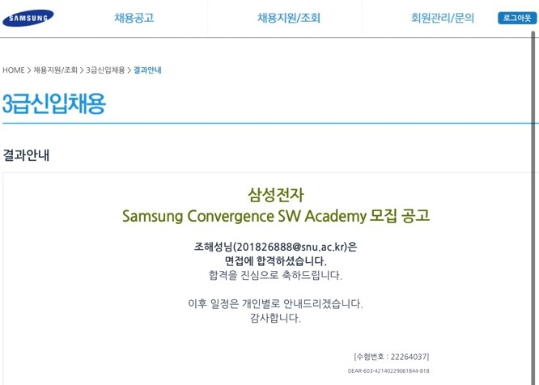
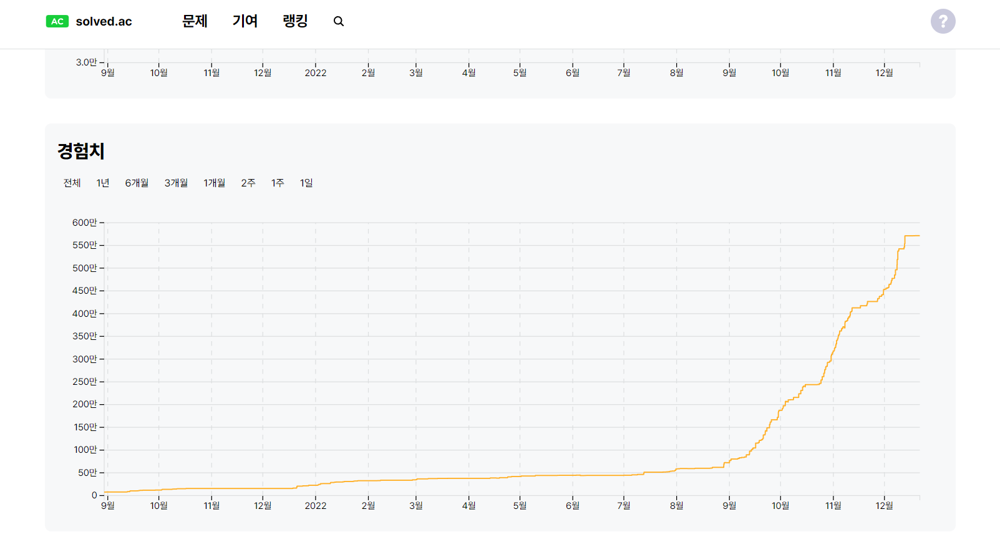

### 삼성전자 공채에 합격하고, 역량테스트에서 세 번 떨어진 기록

**공채 합격 안내**

 

> **덧붙임(2026-09-03):** 2022년 12월에 쓴 글이다. 블로그를 옮기면서 사실과 흐름은 그대로 두고, 그때의 감정이 지나치게 앞섰던 몇 문장만 다듬었다. 결과와 원인에 대한 판단은 손대지 않았다.

2022년 7월, 삼성전자 DX 사업부로 SCSA 19기에 합격했다. 프론트엔드 개발 직무로 취업하는 데 집중하느라 GSAT과 면접 준비는 거의 못 한 상태였는데, 평소 습관처럼 지원했다가 최종까지 붙었다. 그 전에 다른 회사 최종 면접에서 두 번 떨어져 본 경험이 면접장에서 도움이 됐던 것 같다.
 

1년간 하루 대부분을 책상 앞에서 보냈던 시간이 결실을 맺은 것 같아 기뻤다. 가족과 함께 저녁을 먹었고, 오랜만에 친구들도 만났다. 입과일만 기다렸다.
 

시간이 흘러, OT가 시작되면서 매주 시험과 SW 역량테스트를 통과하면 완전히 입사된다는 공지를 받게 되었다. 생각지도 못한 얘기에 많은 걱정을 했지만 기존 SCSA 선배들과 여러 게시글을 통해 '조금만 공부하면 되니 걱정하지 말라'는 말들에 한시름 내려놓았다. 하지만, 교육이 시작되면서 SSAFY 때보다 더 어려운 내용들을 학습하기 위해 더 많은 공부량으로 6개월을 보냈다. 고시생처럼 밥 먹고 자는 시간 외에는 공부밖에 하지 않았다. 역량테스트를 대비하기 위해 매일 아침 8시부터 새벽 2시까지 알고리즘을 학습하면서 대략 3개월 ~ 4개월간 400문제 이상의 알고리즘 문제를 해결했다. 알고리즘에 매우 취약해서 백준 기준, 실버 3 수준의 문제도 어려워했었지만, 시간이 지나, 골드 1~2문제도 거뜬히 해결하는 나 자신을 보며 노력을 통해 많이 성장했다는 성취감과 자신감에 시험을 보게 되었다.
 

시험 당일, 기존 기출문제와는 다른 유형과 난이도로 심각하게 당황했다. 문제를 읽고 설계하는 데만 한 시간 이상을 소비했다. 결국 히든 테스트 케이스를 하나 맞추지 못해 탈락했다. 두 번째 시험까지 한 달간 기출문제를 2~3회 반복해 풀고 다양한 문제를 해결하며 더 큰 노력을 기울였다. 하지만 시험은 그 학습량으로 얻은 자신감이 무색할 만큼 어려웠다. 세 번째 시험까지 치렀지만 또 테스트 케이스를 다 해결하지 못해 최종 탈락했다. 6개월간의 교육에 열심히 참여하고 매주 시험을 통과했더라도, 역량테스트에 떨어지면 입사가 취소되었다. 하루는 아무것도 못 하고 보냈다. 출제 경향이 왜 하필 이번 기수부터 바뀌었나 하는 생각도 했고, 시작하지 말걸 그랬나 싶기도 했다. 하지만 결국 준비가 부족했던 것이라는 사실을 인정하는 데까지 오래 걸리지는 않았다. 유형이 바뀌어도 풀어내는 사람은 있었다.

 

이 글을 쓰는 이유는 결과가 아니라 6개월간 후회 없이 해봤다는 사실을 남겨 두기 위해서다. 지금의 감정을 잊지 않고, 어디에 있든 제 몫을 하는 사람이 되는 쪽으로 갚으려고 한다. 다시 마음을 가다듬고 개발 블로그를 시작한다. 언젠가 이 날도 웃으면서 말할 수 있게 되겠지.

 

> **2026년에 덧붙임.** 이 시기에 매일 붙잡고 있던 알고리즘 문제들은 [알고리즘](/algorithms/)에 남아 있다. 결과적으로 그때 들인 시간은 지금 일하는 데 남았다. 실버 3에서 막히던 사람이 골드를 푸는 데까지 걸린 3~4개월이, 막히는 문제를 붙잡고 있는 감각을 만들어 줬다고 생각한다.

 
